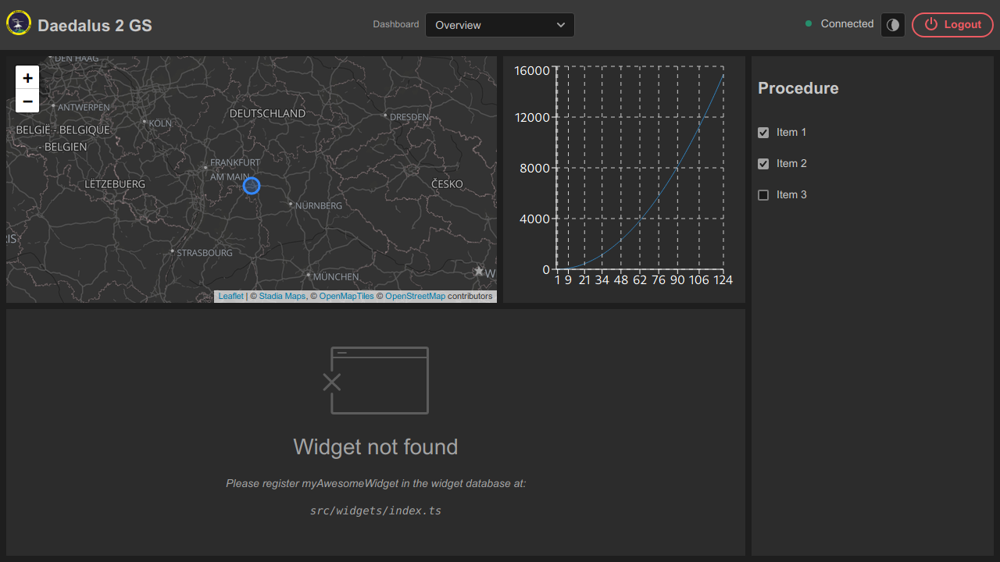

<p align="center">

</p>

# D2 - Ground Station Frontend

The Groundstation Frontend for Daedalus2 written in [TypeScript](https://www.typescriptlang.org/)
with [React](https://reactjs.org/) and [Adobe Spectrum](https://spectrum.adobe.com/) as design system

## Installation

To install all development dependencies, go in the project root directory and run:
```sh
$ npm ci
```

After installation make a copy of the `.example.env` file
and name it `.env` in the project root folder to apply final configuration 

In this file, API keys and other secrets in the environment variables that are necessary for production compilation get defined.

## Running

To run the project in development mode, please execute:
```sh
$ npm start
```

## Testing and Linting

The project has numerous linters and tests to check the current state of the project.

To run all checks and tests, simply execute:
```sh
$ npm run check
```

### Prettier

[Prettier](https://prettier.io/) is an opinionated code formatter.
It removes all original styling* and ensures that all outputted code conforms to a consistent style.

To style your source files, run:
```sh
$ npm run prettier
```

### ESLint

[ESLint](https://eslint.org/) is a code linter and analyzer. It detects syntax errors in your code.

ESLint is integrated in the `start` and `build` scripts and give you many rules
to control the style, syntax and usage of Javascript functionality.

### TypeScript

[TypeScript](https://www.typescriptlang.org/) extends JavaScript by adding types.

To check for type errors in your code, run:
```sh
$ npm run ts
```

### Jest

[Jest](https://jestjs.io/) is a delightful JavaScript Testing Framework with a focus on simplicity.

It tests your components with predefined unit-tests.

To run all tests, call:
```sh
$ npm test
```

## Building

Builds the app for production to the `build` folder.<br />
It correctly bundles React in production mode and optimizes the build for the best performance.

The build is minified and the filenames include the hashes.

To build the current source code into a ready to deploy state, run:
```sh
$ npm run build
```

Or package the compiled code into an electron app, simply run:
```sh
$ npm run build:electron
```

To build ready to deploy electron apps for all operating systems, simply execute:
```sh
$ npm run package:all
```

## Project Structure

```yaml
root:
  package.json  # includes all project info (dependencies, scripts, ...)
  README.md
  src:
    index.tsx   # entry point 
    styles.scss # global styles
    model:      # global classes/types/interfaces
      AppState.ts
      MyAwesomeType.ts
    app:        # app specific folder
      index.tsx
      index.test.tsx
      components: # app components
        Dashboard.tsx
        WidgetWrapper.tsx
    widgets:    # folder containing all widgets
      widget-1:
        index.tsx
        components: # widget components
          MyAwesomeComponent.tsx
        model:      # widget models
          MyType.ts
      widget-2:
        index.tsx
        components:
          MyAwesomeComponent.tsx
        model:
          MyType.ts
    hooks:  # global reusable routines
      useSocket.ts
      useAppState.ts
  public:   # html, images, icons, ...
    index.html
    favicon.ico
```

## Learn More

To learn React, check out the [React documentation](https://reactjs.org/).

## Notice

Original source code of eventbus handler here:
- https://github.com/vert-x3/vertx-web/blob/master/vertx-web/src/client/vertx-eventbus.js

and NOT here:
- https://github.com/vert-x3/vertx-stack
- https://github.com/vert-x3/vertx-bus-bower
